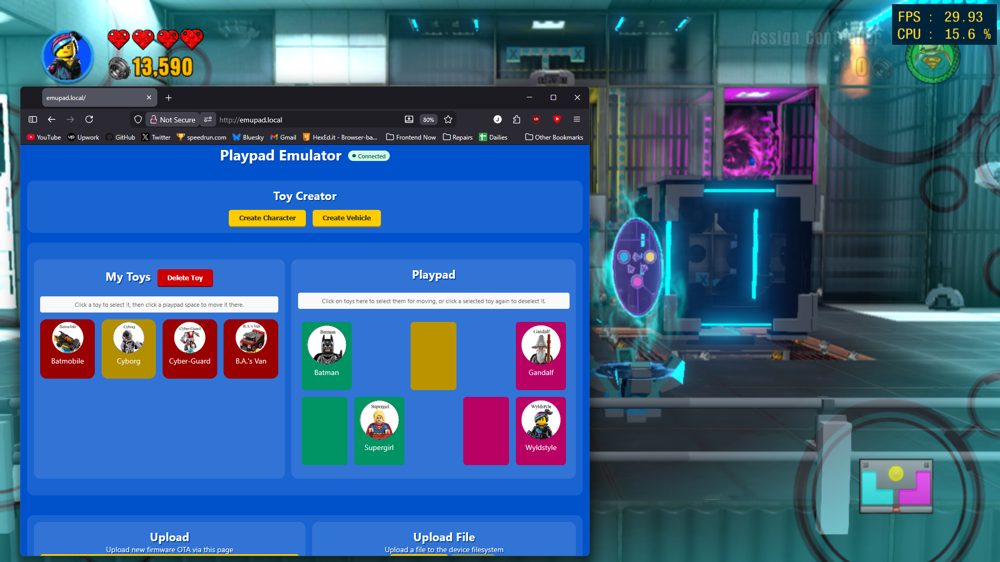

# `basic-emulator`

A hardware/firmware project that emulates a LEGO Dimensions Toypad using a Raspberry Pi Pico W (or Pico 2W). It presents itself to a host console as a genuine playpad, and exposes a web interface for managing toys, placing them on the pad, etc.



---

## Firmware

The firmware lives in `firmware/` and is built with **PlatformIO**.

### Prerequisites

- [PlatformIO Core](https://docs.platformio.org/en/latest/core/installation/index.html) (CLI or IDE)
- A Raspberry Pi Pico W **or** Pico 2W
- A USB cable

### Building & Flashing

```bash
# Clone / enter the firmware directory
cd firmware

# Build for your target platform: `picow` or `pico2w`
pio run -e pico2w

# Flash (put the board in BOOTSEL mode first, then)
pio run -e picow --target upload
```

The project uses the `earlephilhower` Arduino core for RP2040/RP2350 and the `LittleFS` filesystem. Key library dependencies (resolved automatically by PlatformIO) are:

- `ESPAsyncWebServer` - async HTTP server
- `ElegantOTA` - over-the-air firmware updates
- `ArduinoJson` - JSON serialization
- `Adafruit TinyUSB Library` - USB HID stack

### Uploading the Filesystem Image

The web interface (`data/`) must be uploaded to the Pico's LittleFS partition separately:

```bash
pio run -e picow --target uploadfs
```

This packages tag images, etc into a LittleFS image and writes it to the device.

---

## First-Time Setup

On first boot (or after a factory reset), the device has no Wi-Fi credentials and enters **captive-portal mode**:

1. The LED on the board blinks 5 times rapidly to indicate portal mode.
2. A Wi-Fi access point named `captive` appears. Connect to it from your phone or computer.
3. Your device should automatically redirect to the setup page. If it doesn't, navigate to `http://192.168.4.1`.
4. Enter your Wi-Fi **SSID** (Name) and **Password**, then tap **Connect**.
5. The device saves the credentials, reboots, and connects to your network.

After a successful connection, the device should be accessible at:

```
http://emupad.local
```
---

## Using the Web Interface

The main page at `http://emupad.local` is divided into three areas: **Toy Creator**, **My Toys / Playpad**, and an **Advanced** section.

### Toy Creator

Click **Create Character** or **Create Vehicle** to open a selector modal populated from the built-in JSON databases (`json/characters.json` and `json/vehicles.json`). These contain every released LEGO Dimensions character and vehicle along with their IDs and abilities.

- For **characters**, click the character's portrait to add it to your toybox.
- For **vehicles**, expand the entry to see the base form and any rebuild variants, then click the one you want.

Each toy is assigned a random NFC UID at creation time so the game treats it as a unique physical tag.

### Playpad

The on-screen playpad mirrors the physical layout of the real LEGO Dimensions toypad:

```
[ Left  ]       [ Center ]       [ Right ]
[ Left  ][ Left ]         [ Right ][ Right ]
```

**Moving a toy onto the pad:**
1. Click a toy in the **My Toys** list - it highlights with a blue dashed border.
2. Click any empty pad space. The toy moves there and the host console is notified via a USB HID event.

**Moving a toy between pad spaces:**
1. Click a toy already on the pad to select it.
2. Click another pad space (occupied or empty). The toys swap.

**Moving a toy back to the toybox:**
- Click a selected toy on the pad a second time, or click **Delete Toy** while a toybox toy is selected to permanently remove it.

The pad color/flash/fade animations shown in the UI are driven by a **WebSocket** connection (`ws://emupad.local/ws`) that mirrors the real LED state pushed by the game.